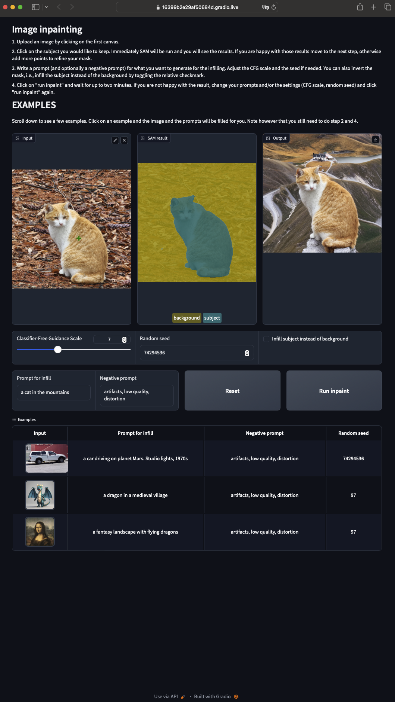
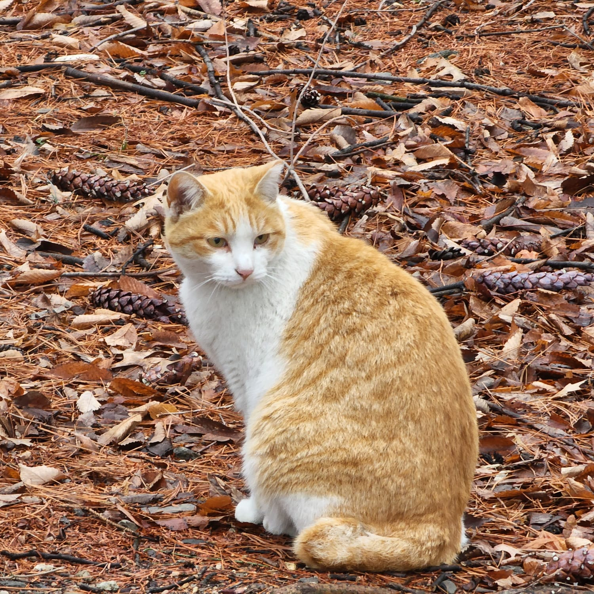
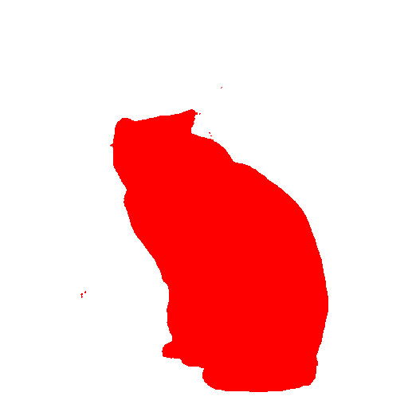
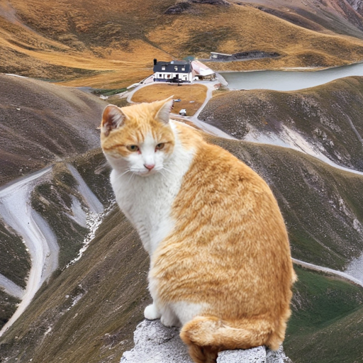

## AI Photo Editing with Inpainting

### Overview

This notebook demonstrates how to perform AI photo editing using inpainting with the Stable Diffusion model. The notebook is divided into three main parts:
1. **Segmentation Mask Creation with SAM (Segment Anything Model)**
2. **Inpainting Setup and Execution**
3. **Interactive Web App**

### Segmentation Mask Creation with SAM

1. **Loading the Pre-trained SAM Model:**
   - The notebook starts by loading a pre-trained SAM model from Facebook/Meta. The model is moved to the GPU and configured with `torch_dtype=torch.float16`.

2. **Generating the Mask:**
   - A function uses SAM to produce a segmentation mask. The function takes an image and points indicating the subject in the image to generate the mask.

3. **Testing the Mask Generation:**
   - The mask generation is tested on a sample image of a car. The image is resized to 512x512 pixels, points are defined to indicate the car, and the mask is generated and visualized.

### Inpainting Setup and Execution

1. **Loading the Inpainting Pipeline:**
   - The inpainting pipeline is set up using the `diffusers/stable-diffusion-xl-1.0-inpainting-0.1` pre-trained model and `AutoPipelineForInpainting`.

2. **Inpainting Function:**
   - A function performs inpainting. The function takes the raw image, the mask generated by SAM, a text prompt for the infill, optional negative prompt, optional seed for repeatability, and the Classifier-Free Guidance Scale (CFGS).

3. **Testing the Inpainting:**
   - The inpainting function is tested on the mask obtained earlier with SAM to produce the final edited image.

### Interactive Web App

1. **Creating the Interactive App:**
   - An interactive app allows users to upload an image, run SAM, and generate a new background through a text prompt. 

2. **Running the App:**
   - Instructions are provided to run the app and access the public URL for using the app.


### Example Results

- **Gradio Page Screenshot:**

  

- **Source Image:**

  


- **Prompt:**
  ```
  a cat in the mountains
  ```

- **SAM Segmented Mask:**

  

- **Output Image:**

  

Note: The subject can be changed depending on the use case.

### Environment Setup

1. **Creating a Conda Environment:**
   - Create a Conda environment with Python 3.10 using the following commands:
     ```bash
     conda create --name inpaint python=3.10
     conda activate inpaint
     pip install -r requirements.txt
     ```

### Summary

For detailed code and step-by-step execution, refer to the cells in the notebook. Each section is well-commented to provide additional context.