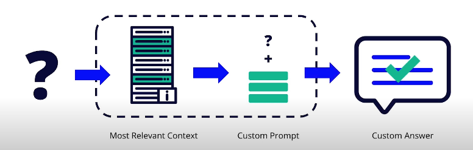
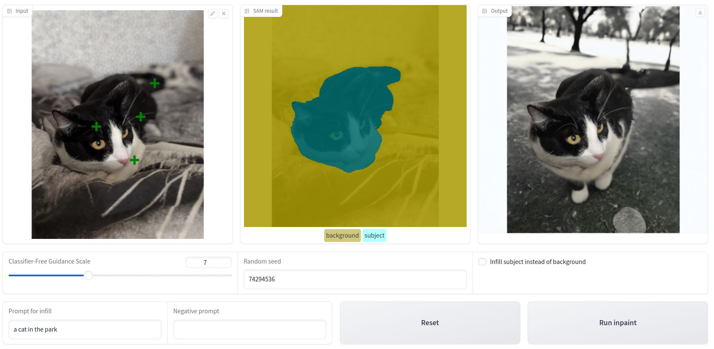

# Udacity Generative AI Nanodegree Program Projects

## Projects

### 01. [Applied Lightweight Fine-Tuning to a Foundation Model](assets/P1-PEFT.jpg)
*Picture from [Source](https://magazine.sebastianraschka.com/p/practical-tips-for-finetuning-llms)*

  
Description

  Implemented advanced techniques to fine-tune a foundation model using Hugging Face and PyTorch.

### 02. [Built a Custom Chat Bot]

  
Description

  Created a custom chatbot using retrieval-augmented generation without fine-tuning by preparing datasets, implementing semantic search, and composing queries.

### 03. [AI Photo Editing with Inpainting]

  
Description

  Used the Segment Anything Model (SAM) and Stable Diffusion to replace parts of images with AI-generated content based on user input.

### 04. [Personalized Real Estate Agent]

  
Description

  Developed an application that used LLMs, vector databases, semantic search, and RAG techniques to transform real estate listings into personalized narratives.

## Udacity - Graduation Certificate

Check out the Syllabus [here](./assets/Generative-AI-Syllabus.pdf)
